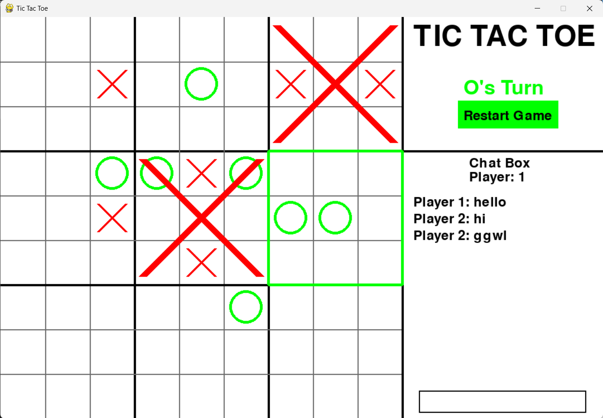
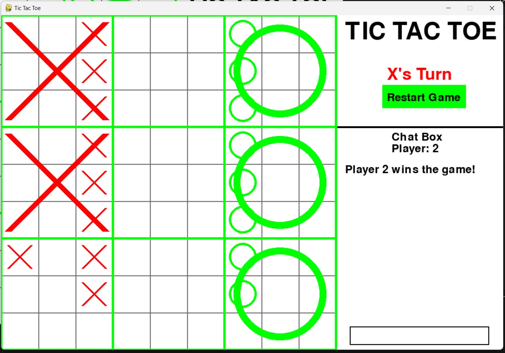
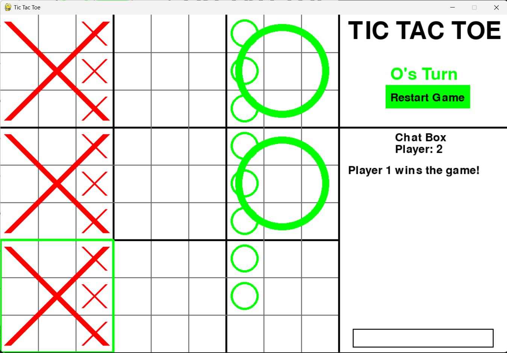
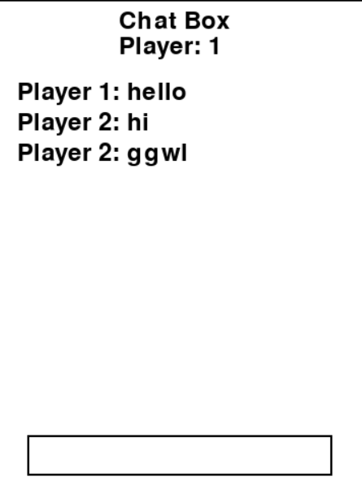
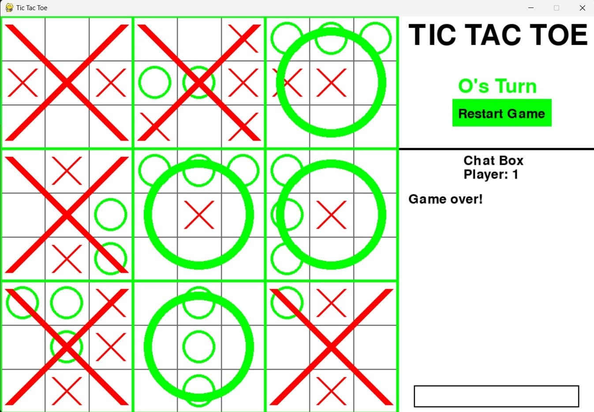

# Tic-tac-toe

## Projects

[Tic-tac-toe](https://github.com/YangTris/Tic-tac-toe)

| **Description project**   | Tic-tac-toe advance mode is a two-player game played on a 9x9 grid. Players take turns marking either an "X" or an "O" in empty cells. The goal is to be the first to create a line of three of your symbols horizontally, vertically, or diagonally. It's simple yet strategic, often used as a teaching tool for basic game theory and critical thinking. |
| ------------------------- | ----------------------------------------------------------------------------------------------------------------------------------------------------------------------------------------------------------------------------------------------------------------------------------------------------------------------------------------------------------- |
| **Technologies used**     | Python, Pygame, Socket, Threading, Git, VS Code                                                                                                                                                                                                                                                                                                             |
| **Team size**             | 2 members                                                                                                                                                                                                                                                                                                                                                   |
| **Time start - Time end** | April 2024 - Present                                                                                                                                                                                                                                                                                                                                        |
| **Responsibility**        | • Create socket that can connect player from client to server <br> • Async the screen using threading <br> • Create logic code <br> • Create UI <br> • Generate chat function                                                                                                                                                                               |
| **Learning from project** | • Learned how to use socket and threading <br> • Learned how to build multiplayer game <br> • Solved problems relating to asynchronous tasks                                                                                                                                                                                                                |
| **Github**                | [](https://github.com/YangTris/Tic-tac-toe)                                                                                                                                                                                                                           |
| **Domain name**           | Update later                                                                                                                                                                                                                                                                                                                                                |

## Installing Packages

- Install the following package dependencies using pip:

```
pip install pygame
```

## How to Play?

- Clone the Repository

```
git clone https://github.com/YangTris/Tic-tac-toe
```

- Start the Server

```
python server.py
```

- Start two players and enter the IP address. If both the players are on same host, use the loopback IP `127.0.0.1` or `localhost`.

  - Player 1

  ```
  python player.py
  pygame 2.5.2
  Hello from the pygame community. https://www.pygame.org/contribute.html
  You are player 1
  ```

  - Player 2

  ```
  python player.py
  pygame 2.5.2
  Hello from the pygame community. https://www.pygame.org/contribute.html
  You are player 2
  ```

- Now you can start playing Tic Tac Toe over a network.

---

## Report PDF


## The rule

Giống như Cờ Caro thông thường, Ultimate Tic-Tac-Toe là trò chơi dành cho 2 người chơi
(X và O), chơi theo lượt, bắt đầu với người chơi X. <br>

#### Trò chơi bắt đầu như thế nào? <br>

• Người chơi X được đánh dấu X của mình vào bất kỳ ô trống nào trong tổng số 81 ô trống
trên bàn cờ lớn. <br>
• Lượt tiếp theo, đối thủ (O) bị buộc phải đánh dấu vào ô trống trong bàn cờ nhỏ tương ứng
với vị trí mà X vừa đánh dấu trên bàn cờ lớn. Ví dụ: nếu X đánh dấu vào ô trống phía
trên bên phải của một bàn cờ nhỏ (3x3), thì O phải đánh dấu vào bàn cờ nhỏ nằm ở phía
trên bên phải của bàn cờ lớn. <br>
• Người chơi đánh dấu vào bất kỳ ô trống nào trong bàn cờ nhỏ được chọn sẽ xác định bàn
cờ nhỏ nào mà người chơi kia phải đánh dấu vào lượt tiếp theo.
Chiến thắng một ô nhỏ: <br>
• Nếu một nước đi tạo thành một hàng ngang, dọc hoặc chéo gồm 3 ký hiệu giống nhau theo
luật chơi của Cờ Caro thông thường trong một bàn cờ nhỏ, thì toàn bộ bàn cờ nhỏ đó được
đánh dấu là đã thắng bởi người chơi đó trên bàn cờ lớn. <br>
• Một khi một bàn cờ nhỏ đã được một người chơi thắng hoặc được đánh dấu đầy đủ, thì
không thể đánh thêm bất kỳ nước đi nào vào bàn cờ đó nữa. <br>

#### Nếu bị "gửi" đến một bàn cờ đã thắng hoặc đầy: <br>

Nếu một người chơi bị "gửi" đến một bàn cờ nhỏ đã được thắng hoặc đầy đủ, thì người chơi đó
có thể đánh dấu vào bất kỳ bàn cờ nhỏ nào khác trên bàn cờ lớn. <br>

#### Kết thúc trò chơi: <br>

Trò chơi kết thúc khi một trong hai người chơi thắng trên bàn cờ lớn (bằng cách tạo thành một
hàng ngang, dọc hoặc chéo gồm 3 bàn cờ nhỏ đã thắng của mình) hoặc không còn nước đi hợp
lệ nào còn lại. Trong trường hợp không còn nước đi hợp lệ, trò chơi được tuyên bố là hòa. <br>

## Screenshots

### Game play



### X's win



### O's win



### Chat box



### Tie game


